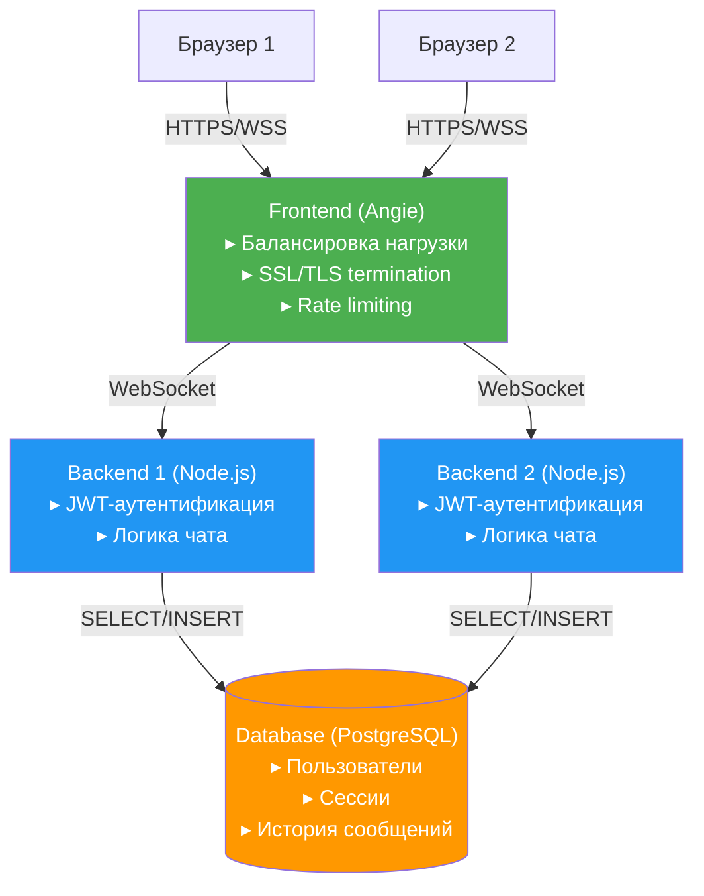

```mermaid
graph TD;
    Client1[Браузер 1] -->|HTTPS/WSS| Frontend;
    Client2[Браузер 2] -->|HTTPS/WSS| Frontend;
    
    Frontend["Frontend (Angie)
    ▸ Балансировка нагрузки
    ▸ SSL/TLS termination
    ▸ Rate limiting"];
    
    Frontend -->|WebSocket| Backend1;
    Frontend -->|WebSocket| Backend2;
    
    Backend1["Backend 1 (Node.js)
    ▸ JWT-аутентификация
    ▸ Логика чата"];
    
    Backend2["Backend 2 (Node.js)
    ▸ JWT-аутентификация
    ▸ Логика чата"];
    
    Backend1 -->|SELECT/INSERT| Database;
    Backend2 -->|SELECT/INSERT| Database;
    
    Database[("Database (PostgreSQL)
    ▸ Пользователи
    ▸ Сессии
    ▸ История сообщений")];
    
    style Frontend fill:#4CAF50,color:white
    style Backend1 fill:#2196F3,color:white
    style Backend2 fill:#2196F3,color:white
    style Database fill:#FF9800,color:white
```
