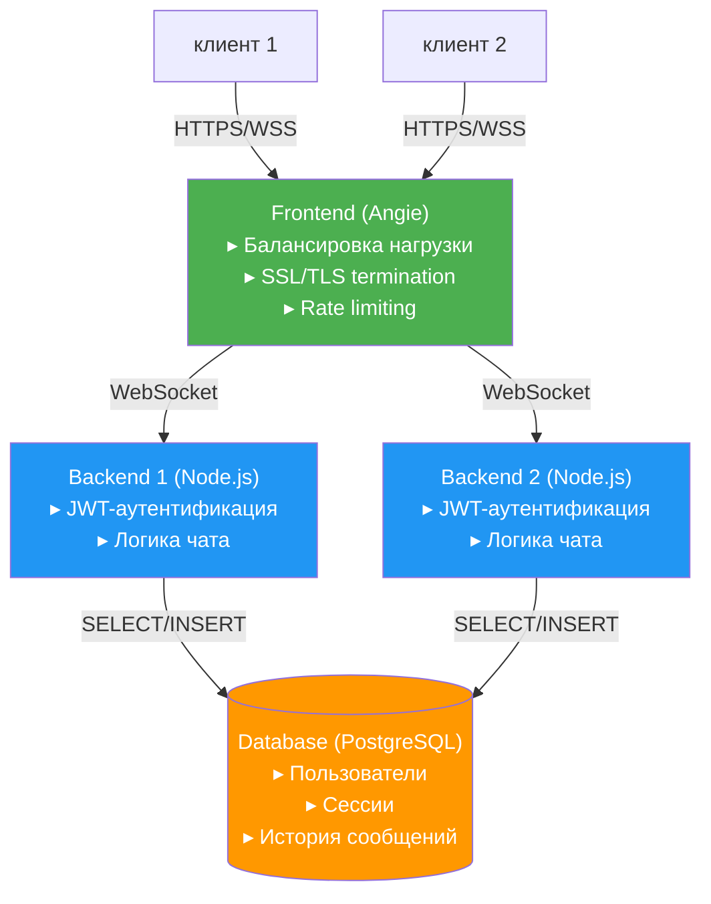

Решение по балансировке нагрузки с указанием директив конфигурации.

upstream chat-upstream {
  server backend1:3000;
  server backend2:3000;
  zone chat-upstream 256k;
  least_conn;

  # Защита бэкендов
  keepalive 32;
  keepalive_requests 100;
  keepalive_timeout 60s;
}


### **3. Клиентская и серверная оптимизация (частично выполнено)**
- **Что сделано**:  
  - **Серверная**:  
    - Пулинг подключений к PostgreSQL и Redis.  
    - Использование JWT для быстрой аутентификации.  
  - **Клиентская**:  
    - Загрузка истории сообщений пачками (лимит 50).  
    - WebSocket вместо HTTP-опросов (long polling).  
- **Что добавить**:  
  - **Серверная**:  
    - Кеширование сообщений в Redis (например, топ-100).  
    - Сжатие ответов API (gzip).  
    ```nginx
    gzip on;
    gzip_types application/json;
    ```  
  - **Клиентская**:  
    - Ленивая загрузка изображений (если будут).  
    - Оптимизация WebSocket (переподключение с экспоненциальной задержкой).
