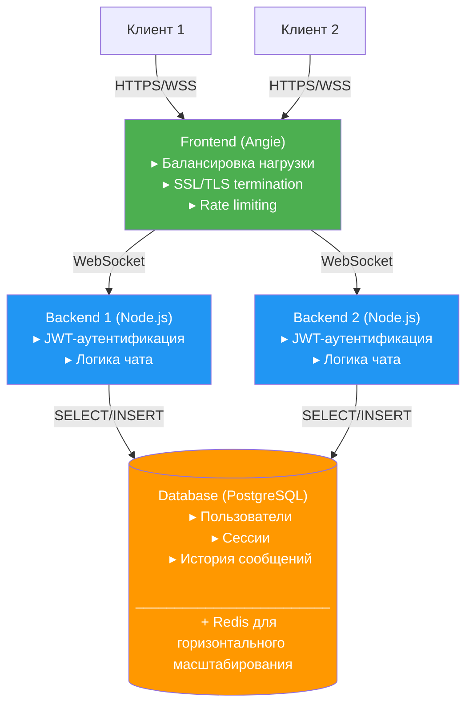

## Графическая схема взаимодействия элементов приложения.



## Решение по балансировке нагрузки с указанием директив конфигурации
```nginx
upstream chat-upstream {
  server backend1:3000;
  server backend2:3000;
  zone chat-upstream 256k;
  least_conn;

  # Оптимизация подключений
  keepalive 32;
  keepalive_requests 100;
  keepalive_timeout 60s;
}
```

**Параметры:**
- `least_conn` - балансировка по наименьшему числу соединений
- `keepalive` - пул постоянных соединений к бэкендам
- `zone` - разделяемая память для статистики

## Элементы клиентской и серверной оптимизации с обоснованием и директивами конфигурации.

### Серверная
- Пулинг подключений к PostgreSQL и Redis
- JWT для быстрой аутентификации

### Клиентская
- Пакетная загрузка истории сообщений (лимит 50)
- Кеширование статики

## Защита от DoS-атак

### 1. Таймауты против Slowloris
```nginx
client_body_timeout 5s;
client_header_timeout 5s;
keepalive_timeout 10s;
send_timeout 5s;
```
# Таймауты NGINX и защита от Slowloris

| Таймаут               | Описание                                                                                         | Роль против Slowloris                                                                                          |
|-----------------------|-------------------------------------------------------------------------------------------------|---------------------------------------------------------------------------------------------------------------|
| **client_header_timeout 5s** | Ограничивает время ожидания полной отправки HTTP-заголовков клиентом, не более 5 секунд.         | Закрывает соединение, если заголовки идут слишком медленно, предотвращая зависание на этапе получения заголовков. |
| **client_body_timeout 5s**   | Максимальное время ожидания отправки тела запроса (POST и др.), также 5 секунд между пакетами.  | Прерывает соединение при слишком медленной отправке тела запроса, не давая удерживать соединение длительно.   |
| **send_timeout 5s**          | Максимальное время, в течение которого сервер пытается отправлять данные клиенту, ожидая подтверждения. | Закрывает соединение, если клиент долго не принимает данные, предотвращая зависание при медленном получателе. |
| **keepalive_timeout 10s**   | Время, в течение которого неактивное соединение остаётся открытым после завершения запроса.     | Ограничивает время «пустого» соединения, быстро освобождая ресурсы от неиспользуемых сессий.                   |

Эти настройки обеспечивают своевременное завершение подозрительно медленных HTTP-соединений, тем самым значительно снижая эффект атак Slowloris, которые базируются на удержании соединений открытыми с минимальной передачей данных.


### 2. Лимиты запросов
```nginx
limit_conn_zone $binary_remote_addr zone=conn_per_ip:10m;
limit_req_zone $binary_remote_addr zone=req_per_ip:10m rate=10r/s;
limit_req_zone $binary_remote_addr zone=ws_req_ip:10m rate=30r/s;

# Для WebSocket
limit_req zone=ws_req_ip burst=40 nodelay;
limit_conn conn_per_ip 10;
```


| Настройка                     | Тип трафика   | Лимит             | burst | Назначение                      |
|------------------------------|---------------|-------------------|-------|--------------------------------|
| limit_conn_zone + conn_per_ip | TCP/WS        | 10 соединений/IP  | –     | Защита от перегрузки соединений |
| limit_req_zone + req_per_ip   | HTTP          | 10 запросов/сек/IP| 20    | Защита REST API                |
| limit_req_zone + ws_req_ip    | WebSocket     | 30 сообщений/сек/IP| 40    | Отдельный лимит для WebSocket-сообщений   |


### 3. Фильтрация угроз
```nginx
# Блокировка сканеров
if ($http_user_agent ~* (bot|crawler|scan|nikto|sqlmap)) {
    return 444;
}

# Защита служебных путей
location ~* ^/(\.git|\.env|backup) {
    deny all;
    return 403;
}
```

### 4. WebSocket защита
```nginx
proxy_websocket_max_frame_size 32k;
proxy_websocket_keepalive_timeout 60s;
proxy_read_timeout 3600s;
```
| Директива                          | Значение  | Описание                                                                                                                                 | Когда использовать                     |
|-------------------------------------|-----------|-----------------------------------------------------------------------------------------------------------------------------------------|----------------------------------------|
| `proxy_websocket_max_frame_size`    | `32k`     | Максимальный размер одного WebSocket-фрейма. Клиенты с фреймами >32K будут отключены.                                                    | При риске DDoS-атак большими фреймами. |
| `proxy_websocket_keepalive_timeout` | `60s`     | Таймаут неактивных соединений. Закрывает соединение, если в течение 60 сек не было данных.                                               | Для очистки "висящих" соединений.      |
| `proxy_read_timeout`                | `3600s`   | Таймаут ожидания данных от клиента. Для WebSocket рекомендуется высокое значение (1 час).                                                 | Для долгоживущих WS-соединений.        |


